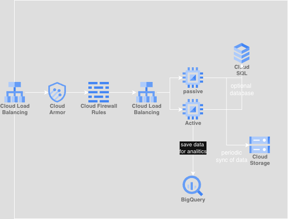
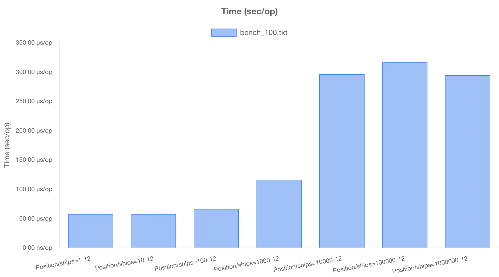

## How to run 

```bash
docker compose up -d
```

starts two containers:

* web-jjnouxmwqg - starts server listening on port 8080

* test-ajnauxrwqb - runs all tests in the repository. Does not effect real server.

## Configuration

`PORT` env variable to change serving port

## Assumtions & edge cases

1. Position ship main logic is transactional
2. Red status does not change system state
3. Tower at 0,0 participates in collision detection
4. Max speed is 100. Ships which "jump" exceeding max speed are not over corrected.  
5. speed calculated linearly
6. Speed calculated using actual positions if avaliable otherwise predicts ship position using last known speed(depending on the time when prediction is happening)
7. Past predictions are allowed
8. Client is responsible for generation of uniq ids for the ships

## Alogrithm and edge cases

Detailed explanation can be found here `pkg/traffic/traffic.go`

N - number of ships

M - number of history reconds of each ship

W - prediction window in seconds

time complexity: `O(N * Log(M))`

space complexity: `O(W)` or `O(W + N * M)` if you count storage as well 

1. Calculate speed of ship from the request

    * if previous position is found use coordinates to calculate speed, otherwise speed is 0

2. go over all ships
3. For each ship find relevant history

    * To find relevant history we need to find time window [start: start + 60] positions
    * why do we need window not just first position? because ship can have many updates during 60s time range
    * Binary search is fastest way to do it since history data is already sorted

      ```
      maybe second search for the end could be linear? - depends on density of updates
      with small density for next 60 seconds second linear search will be very fast
      however I don't want to make assumptions about the density of updates
      so we will use binary search for both
      on second thought, linear search could have better CPU cache performance - benchmark later
      well I didn't found time to benchmark this :) binary search it is
      ```

    * When window found it could be one of:
        1.  positions cover all time window, start at `start` and end at `start + 60` - no additional work needed
        2. all positions in the future - nothing to do we are not going to collide with them
        3. `start` is not covered or all positions before `start` - use latest found position and predict ship position at `start` time.
    * Speed need to be recalculated for better accurancy:
    ```
    At time of ps.Time we might not see future positions which will tell us
		real trajectory of the ship
		e.g.
		time = 1, x = 0, y = 0, speed = 0,0
		time = 2, x = 1, y = 1, speed = 1,1
		time = 100 x = 100, y = 0, speed = 1,0 -- very different trajectory from the last one
		and out of the prediction window, which means we don't know the speed
		so we calculate REAL speed using future position we already know
    ```
4. For each found position check minimum distance to the ship from request
    * align ship in time
    * calculate relative position and relative velocity
    * if velocity is 0, distance not going to change - use it
    * use little bit of linear algebra to figure out when will be closest distance between ships
    * choose smallest distance at `start` `t min distance`(from above), `start + 60`(or other delta)
5. finally choose status
    * If status is red - stop searching it's not going to get any better
    * status priority red > yellow > green. Don't override status with higher priority with lower priority.
  
### edge cases

* 0,0 - tower
* ships can jump surpassing max speed - try to use future position to calculate speed,
speed may not be correct, but at least trajectory is correct
* ships with very old updates - even though their position is far away from time in the request they could be close
* don't collide with it self


## System design  

Solution is based on simple http server and layered architecture:

1. HTTP RESTAPI layer - manager everything related to communication
2. Core layer - contains main logic with it's own data structures 

Solution uses InMemory storage. Which can handle 100_000_000 entities with good enough prefromance.

To handle bigger scale data could be stored in PostgreSQL.

Cloud examples are for production development of the solution and  not implemented here.

### Capacity management

#### History

each ship takes:

id - 32 bytes - assume uuid
status - 1 bytes - int encoding 
position - 8 * 3 = 24 bytes - time, x, y

in total for one ship: 32 + 1 + 24 = 57 bytes (golang internal cost like slice ignored because data storage could be changed) 

100_000_000(100 million) ships - 5,7 GB
1_000_000_000(billion) ships  - 57 GB

If persistance is not required single server can handle billion ships

Per micro benchmarks(could use some improvement but ball park is good enough) `/position` 290us per request

Single **12cpu 128gb** memory will be enough.

To mitigate single point of failure second we will use active-passive pattern.

Periodic saving of data to cold storage like S3 can be done to sync active-passive instances to prevent cold starts.

### Concurrent connections: 

each server can handle around 65k to 300k open connections. To mitigate more connections use API gateway.

API gateway will accept 100k connections and keep small number of open connection with API server 100-1000(dependeing on the load) allowing to scale to million of connection.

Cloud armor for DDOS protection.



Additionaly all data is stored in BigQuery for future analitics.

## testing

* pkg/e2e/cases_test.go - e2e tests

* pkg/traffic/traffic_test.go - unit tests for the main logic

## performance & benchmark

* pkg/e2e/benchmarks_test.go - e2e benchmarks

* pkg/traffic/traffic_test.go - benchmark position ship logic 

E2E micro benchmark not concurrent



```
=== RUN   BenchmarkPosition
BenchmarkPosition
=== RUN   BenchmarkPosition/ships=1
BenchmarkPosition/ships=1
BenchmarkPosition/ships=1-12               20475             57126 ns/op           11595 B/op        126 allocs/op
=== RUN   BenchmarkPosition/ships=10
BenchmarkPosition/ships=10
BenchmarkPosition/ships=10-12              20863             57143 ns/op           11998 B/op        135 allocs/op
=== RUN   BenchmarkPosition/ships=100
BenchmarkPosition/ships=100
BenchmarkPosition/ships=100-12             17844             66418 ns/op           16582 B/op        224 allocs/op
=== RUN   BenchmarkPosition/ships=1000
BenchmarkPosition/ships=1000
BenchmarkPosition/ships=1000-12            10000            116272 ns/op           57329 B/op       1029 allocs/op
=== RUN   BenchmarkPosition/ships=10000
BenchmarkPosition/ships=10000
BenchmarkPosition/ships=10000-12           10000            296385 ns/op          199591 B/op       3809 allocs/op
=== RUN   BenchmarkPosition/ships=100000
BenchmarkPosition/ships=100000
BenchmarkPosition/ships=100000-12          10000            316395 ns/op          249436 B/op       4937 allocs/op
=== RUN   BenchmarkPosition/ships=1000000
BenchmarkPosition/ships=1000000
BenchmarkPosition/ships=1000000-12         10000            294344 ns/op          251070 B/op       5088 allocs/op
PASS
```